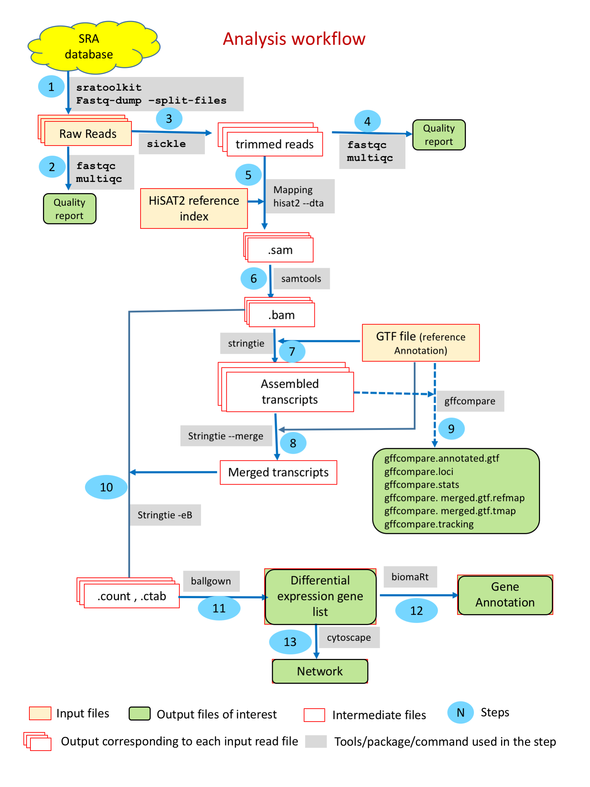
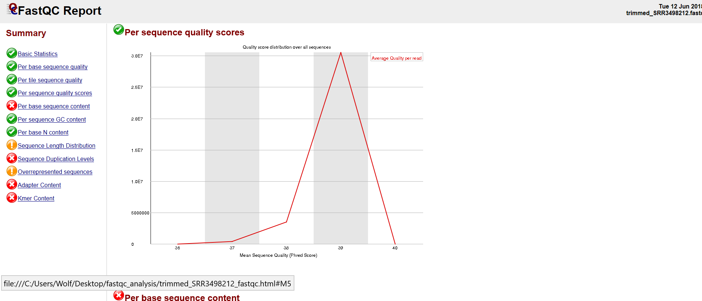
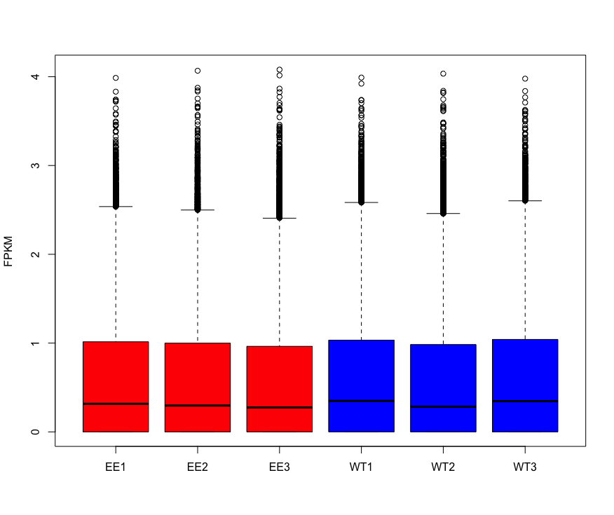

# RNA-Seq for Model Plant (Arabidopsis thaliana)


<h2 >Tutorial</h2>
This repository is a usable, publicly available tutorial for analyzing differential expression data and creating topological gene networks. All steps have been provided for the UConn CBC Xanadu cluster here with appropriate headers for the Slurm scheduler that can be modified simply to run.  Commands should never be executed on the submit nodes of any HPC machine.  If working on the Xanadu cluster, you should use sbatch scriptname after modifying the script for each stage.  Basic editing of all scripts can be performed on the server with tools such as nano, vim, or emacs.  If you are new to Linux, please use <a href="https://bio Informatics.uconn.edu/unix-basics/">this</a> handy guide for the operating system commands.  In this guide, you will be working with common bio Informatic file formats, such as <a href="https://en.wikipedia.org/wiki/FASTA_format">FASTA</a>, <a href="https://en.wikipedia.org/wiki/FASTQ_format">FASTQ</a>, <a href="https://en.wikipedia.org/wiki/SAM_(file_format)">SAM/BAM</a>, and <a href="https://en.wikipedia.org/wiki/General_feature_format">GFF3/GTF</a>. You can learn even more about each file format <a href="https://bio Informatics.uconn.edu/resources-and-events/tutorials/file-formats-tutorial/">here</a>. If you do not have a Xanadu account and are an affiliate of UConn/UCHC, please apply for one <a href="https://bio Informatics.uconn.edu/contact-us/">here</a>.
	
<div id="toc_container">
<p class="toc_title">Contents</p>
<ul class="toc_list">
<li><a href="#First_Point_Header">1 Introduction and programs</>
<li><a href="#Second_Point_Header">2 Accessing the data using sra-toolkit</a></li>
<li><a href="#Third_Point_Header">3 Quality control using sickle</a></li>
<li><a href="#Fourth_Point_Header">4 Aligning reads to a genome using hisat2</a></li>
<li><a href="#Fifth_Point_Header">5 Transcript assembly and quantification with StringTie</a></li>
<li><a href="#Sixth_Point_Header">6 Differential expression analysis using ballgown</a></li>
<li><a href="#Seventh_Point_Header">7 Gene annotation with BiomaRt</a></li>
<li><a href="#Eighth_Point_Header">8 Topological networking using cytoscape</a></li>
<li><a href="#ninth_Point_Header">8 Conclusion</a></li>
</ul>
</div>

<h2 id="First_Point_Header">Introduction and programs</h2>

Arabidopsis thaliana is a small flowering plant that is used as a model system in world of plant biology. It helped researchers to build understanding around molecular, biochemical and genetics processes in the plants.  A wealth of knowledge is available around arabidopsis genomics (genome sequence, transcriptome, genetic markers etc) and hence serve as ideal system to develop fundamental understanding around plant RNA-seq analysis before venturing in the transcriptomics world of non moodel species. In this tutorial we will be using RNAseq dataset from the flower buds of A. thaliana and the study was published in "Frontiers in Plant Science" (https://www.frontiersin.org/articles/10.3389/fpls.2019.00763/full).  This study was aimed at understanding the functional role of Monoacylglycerol lipase (MAGL) hydrolyzes known to produce free fatty acid and glycerol and is well studied in animal kingdom but a little is known about its function in plants. The study involves ectopic expression (EE) of BnaC.MAGL8.a in Arabidopsis to explore its potential biological function. They observed that this ectopic expression causes male sterility by affecting the devlopment of pollens.  To develop their molecular understanding around the process they carried out RNAseq studies in the flower buds.  Total 6 RNAseq datasets representing 3 biological replicates each for WT and BnaC.MAGL8.a were used in this study The RNA profiles are archived in the SRA, and meta Information on each may be viewed through the SRA ID: SRR8428904, SRR8428905, SRR8428906, SRR8428907, SRR8428908, SRR8428909(https://www.ncbi.nlm.nih.gov/Traces/study/?acc=SRP178230).

The Single Read Archive, or SRA, is a publicly available database containing read sequences from a variety of experiments. Scientists who would like their read sequences present on the SRA submit a report containing the read sequences, experimental details, and any other accessory meta-data.

Our data, SRR8428904, SRR8428905, SRR8428906, SRR8428907, SRR8428908, SRR8428909 come from EE1, EE2, EE3, WT1, WT2, and WT3 respectively. Our objective in this analysis is to determine which genes are expressed in all samples, quantify the expression of each common gene in each sample, identify genes which are lowly expressed in  WT1, WT2 and WT3 but highly expressed in  EE1, EE2 and EE3 or vice versa, quantify the relative expression of such genes, and lastly to create a visual topological network of genes with similar expression profiles.

You may connect to Xanadu via SSH, which will place you in your home directory

<pre style="color: silver; background: black;">-bash-4.2$ cd /home/CAM/$USER</pre> 

Your home directory contains 2TB of storage and will not pollute the capacities of other users on the cluster. 

The workflow may be cloned into the appropriate directory using the terminal command:
```bash
git clone https://github.com/CBC-UCONN/RNA-Seq-Model-Organism-Arabidopsis-thaliana.git
```
Then change the directory to the **RNA-Seq-Model-Organism-Arabidopsis-thaliana/** folder, where you can see the following folder structure:  
```
RNA-Seq-Model-Organism-Arabidopsis-thaliana
├── raw_data
├── trimmed_reads
├── trimmed_fastqc
├── mapping
└── ballgown
```

In this tutorial each major section is diveded in to folders so you can follow it easily. As you go you can navigate to each folder, as each section directs you to, and follow the instructions. 


<h2 id="Second_Point_Header">Accessing the data using sra-toolkit </h2>

We know that the SRA contain the read sequences and accessory meta Information from experiments. Rather than downloading experimental data through a browser, we may use the <a href="https://www.ncbi.nlm.nih.gov/books/NBK158900/">sratoolkit</a>'s "fastq-dump" function to directly dump raw read data into the current terminal directory. Let's have a look at this function (it is expected that you have read the Xanadu tutorial, and are familiar with loading modules):

To load the module and to check the options you can simply type `fastq-dump` once you load the module in the terminal window.
```bash
module load sratoolkit

fastq-dump
```

Which will show you the following options it has:
```
  fastq-dump [options] <path> [<path>...]
  fastq-dump [options] <accession>

Use option --help for more  Information

fastq-dump : 2.8.2 
```

For our needs, we will simply be using the accession numbers to dump our experimental data into our directory. We know our accession numbers, so let's write a shell script to retrieve our raw reads. There are a variety of text editors available on Xanadu. My preferred text editor is "nano". Therefore, we will be using nano to write our shell script.

``` 
nano data_dump.sh
```

                                                                                                     
```bash

#!/bin/bash
#SBATCH --job-name=data_dump
#SBATCH --mail-user=your.email@uconn.edu
#SBATCH --mail-type=ALL
#SBATCH -n 1
#SBATCH -N 1
#SBATCH -c 1
#SBATCH --mem=10G
#SBATCH -o %x_%j.out
#SBATCH -e %x_%j.err
#SBATCH --partition=general
#SBATCH --qos=general 

mkdir /home/CAM/$USER/tmp/
export TMPDIR=/home/CAM/$USER/tmp/

module load sratoolkit
fasttq-dump --split-files SRR8428909
mv SRR8428909_1.fastq wt_Rep1_R1.fastq
mv SRR8428909_2.fastq wt_Rep1_R2.fastq

fastq-dump --split-files SRR8428908
mv SRR8428908_1.fastq wt_Rep2_R1.fastq
mv SRR8428908_2.fastq wt_Rep2_R2.fastq

fastq-dump --split-files SRR8428907
mv SRR8428907_1.fastq wt_Rep3_R1.fastq
mv SRR8428907_2.fastq wt_Rep3_R2.fastq

fastq-dump --split-files SRR8428906
mv SRR8428906_1.fastq EE_Rep1_R1.fastq
mv SRR8428906_2.fastq EE_Rep1_R2.fastq

fastq-dump --split-files SRR8428905
mv SRR8428905_1.fastq EE_Rep2_R1.fastq
mv SRR8428905_2.fastq EE_Rep2_R2.fastq

fastq-dump --split-files SRR8428904
mv SRR8428904_1.fastq EE_Rep3_R1.fastq
mv SRR8428904_2.fastq EE_Rep3_R2.fastq
```

The full slurm script is called [data_dump.sh](/raw_data/data_dump.sh) can be found in **raw_data/** folder.  

As a precautionary measure, always include your temporary directory in the environment. While not all programs require a temporary directory to work, it takes far less time including ours in the environment than it is waiting for an error! After typing our script, we press CTRL + X to exit, 'y', and then enter to save.

Now that we have our script saved, we submit it to the compute nodes with the following command:

<pre style="color: silver; background: black;">-bash-4.2$ sbatch data_dump.sh</pre>

Now we wait until we receive an email that our process has finished.

Let's take a look at one of our files:

```bash
-bash-4.2$ head EE_Rep1_R1.fastq
@SRR8428906.1 1 length=150
CCTGAACAACTCATCAGCGGTAAAGAAGATGCAGCTAACAATTTCGCCCGTGGTCATTACACCATTGGGAAAGAGATTGTTGACCTGTGCTTAGACCGTATCAGAAAGCTTGCTGATAACTGTACTGGTCTCCAAGGATTCCTCGTCTTC
+SRR8428906.1 1 length=150
AAAFFJFJJ<FJFJJJJJJJJJFJJJJFJAJJJJJJFJJJJJJJJJJJJFJAJJFJJJJJJJJJJJJAAFJFJJJJFJJJJJFFJJFJJJJJJJJJJFJJ7<AFAJJFFJJJJJJJJJJJJJJJJFJFJ7AJFJJ<AJJJJFJ7FFJJJ-
@SRR8428906.2 2 length=150
GGGTCTTGTATGCCTCAGCAGGGATATCAGCGAAGTAGGTCTCGACAAGAACATTCAAACCAGAAAGAGTTGATTCAAGTTCAGCATAGGCACCAGTAAAGGCCTGGAGTTTCTGACCCTCAAGATCCATAACAAGGACAGGCTCGTCAA
+SRR8428906.2 2 length=150
<AFFFJJJJFJJJJJJJJJJJJJJJJJJJJJJJJJJJJJJJJJJJJJJJJJJJJJJJJJJJJJJJJJJJFJJJJJJJJJJJJJJJJJJJJJJJJJJJJJJJJJ7JJJJJFJJJJJJJJJJJJJJJJJJJFJJJJJJJJJJJJJJJJJ<JJ
@SRR8428906.3 3 length=150
AAAATCTGTAGAATCATCTTTCAACAATGGCTTCCACTGCTCTCTCCAGCGCAATCGTAAGCACCTCTTTCCTCCGCCGTCAACAGACACCAATCAGCCTCAGTTCCCTCCCGTTTGCCAACACACAATCTCTCTTCGGCCTCAAATCTT
```


We see that for our first three runs we have  Information about the sampled read including its length followed by the nucleotide read and then a "+" sign. The "+" sign marks the beginning of the corresponding scores for each nucleotide read for the nucleotide sequence preceding the "+" sign. 

<h2 id="Third_Point_Header">Quality control using sickle</h2>

Sickle performs quality control on illumina paired-end and single-end short read data using a sliding window. As the window slides along the fastq file, the average score of all the reads contained in the window is calculated. Should the average window score fall beneath a set threshold, <a href="https://github.com/najoshi/sickle/blob/master/README.md">sickle</a> determines the reads responsible and removes them from the run. After visiting the SRA pages for our data, we see that our data are single end reads. Let's find out what sickle can do with these:

<pre style="color: silver; background: black;">-bash-4.2$ module load sickle

-bash-4.2$ sickle

<strong>Usage</strong>: sickle <command> [options]

<strong>Command</strong>:
pe	paired-end sequence trimming
se	single-end sequence trimming

--help, display this help and exit
--version, output version  Information and exit</pre>

We have single-end sequences. 

<pre style="color: silver; background: black;">-bash-4.2$ sickle pe

<strong>Usage</strong>: sickle pe [options] -f <paired-end forward fastq file> -r <paired-end reverse fastq file> -t <quality type> -o <trimmed PE forward file> -p <trimmed PE reverse file> -s <trimmed singles file>

<strong>Options</strong>:
Options:
Paired-end separated reads
--------------------------
-f, --pe-file1, Input paired-end forward fastq file (Input files must have same number of records)
-r, --pe-file2, Input paired-end reverse fastq file
-o, --output-pe1, Output trimmed forward fastq file
-p, --output-pe2, Output trimmed reverse fastq file. Must use -s option.

Paired-end interleaved reads
----------------------------
-c, --pe-combo, Combined (interleaved) input paired-end fastq
-m, --output-combo, Output combined (interleaved) paired-end fastq file. Must use -s option.
-M, --output-combo-all, Output combined (interleaved) paired-end fastq file with any discarded read written to output file as a single N. Cannot be used with the -s option.

Global options
--------------
-t, --qual-type, Type of quality values (solexa (CASAVA < 1.3), illumina (CASAVA 1.3 to 1.7), sanger (which is CASAVA >= 1.8)) (required)
-s, --output-single, Output trimmed singles fastq file
-q, --qual-threshold, Threshold for trimming based on average quality in a window. Default 20.
-l, --length-threshold, Threshold to keep a read based on length after trimming. Default 20.
-x, --no-fiveprime, Don't do five prime trimming.
-n, --truncate-n, Truncate sequences at position of first N.
-g, --gzip-output, Output gzipped files.
--quiet, do not output trimming info
--help, display this help and exit
--version, output version information and exit</pre>

The quality may be any score from 0 to 40. The default of 20 is much too low for a robust analysis. We want to select only reads with a quality of 35 or better. Additionally, the desired length of each read is 50bp. Again, we see that a default of 20 is much too low for analysis confidence. We want to select only reads whose lengths exceed 45bp. Lastly, we must know the scoring type. While the quality type is not listed on the SRA pages, most SRA reads use the "sanger" quality type. Unless explicitly stated, try running sickle using the sanger qualities. 

Let's put all of this together for our sickle script using our downloaded fastq files:


<pre style="color: silver; background: black;">-bash-4.2$ nano sickle_run.sh

#!/bin/bash
#SBATCH --job-name=sickle_run
#SBATCH --mail-user=
#SBATCH --mail-type=ALL
#SBATCH -n 1
#SBATCH -N 1
#SBATCH -c 1
#SBATCH --mem=10G
#SBATCH -o sickle_run_%j.out
#SBATCH -e sickle_run_%j.err
#SBATCH --partition=general
#SBATCH --qos=general

export TMPDIR=/home/CAM/$USER/tmp/

module load sickle

sickle pe -t sanger -f ../raw_data/wt_Rep1_R1.fastq -r ../raw_data/wt_Rep1_R2.fastq -o trimmed_wt_Rep1_R1.fastq -p trimmed_wt_Rep1_R2.fastq -l 45 -q 25 -s singles_wt_Rep1_R1.fastq

sickle pe -t sanger -f ../raw_data/wt_Rep2_R1.fastq -r ../raw_data/wt_Rep2_R2.fastq -o trimmed_wt_Rep2_R1.fastq -p trimmed_wt_Rep2_R2.fastq -l 45 -q 25 -s singles_wt_Rep2_R1.fastq

sickle pe -t sanger -f ../raw_data/wt_Rep3_R1.fastq -r ../raw_data/wt_Rep3_R2.fastq -o trimmed_wt_Rep3_R1.fastq -p trimmed_wt_Rep3_R2.fastq -l 4 5-q 25 -s singles_wt_Rep3_R1.fastq

sickle pe -t sanger -f ../raw_data/EE_Rep1_R1.fastq -r ../raw_data/EE_Rep1_R2.fastq -o trimmed_EE_Rep1_R1.fastq -p trimmed_EE_Rep1_R2.fastq -l 45 -q 25 -s singles_EE_Rep1_R1.fastq

sickle pe -t sanger -f ../raw_data/EE_Rep2_R1.fastq -r ../raw_data/EE_Rep2_R2.fastq -o trimmed_EE_Rep2_R1.fastq -p trimmed_EE_Rep2_R2.fastq -l 45 -q 25 -s singles_EE_Rep2_R1.fastq

sickle pe -t sanger -f ../raw_data/EE_Rep3_R1.fastq -r ../raw_data/EE_Rep3_R2.fastq -o trimmed_EE_Rep3_R1.fastq -p trimmed_EE_Rep3_R2.fastq -l 45 -q 25 -s singles_EE_Rep3_R1.fastq

</pre>
<br>

The full slurm script is called [sickle_run.sh](/trimmed_reads/sickle_run.sh) can be found in **trimmed_reads/** folder.  

<pre style="color: silver; background: black;">-bash-4.2$ sbatch sickle_run.sh </pre>

It is helpful to see how the quality of the data has changed after using sickle. To do this, we will be using the commandline versions of <a href="https://www.bio Informatics.babraham.ac.uk/projects/fastqc/INSTALL.txt">fastqc</a> and <a href="http://multiqc. Info/docs/">MultiQC</a>. These two programs simply create reports of the average quality of our trimmed reads, with some graphs. There is no way to view a --help menu for these programs in the command-line. However, their use is quite simple, we simply run "fastqc <trimmed_fastq>" or "multiqc -f -n trimmed trimmed". Do not worry too much about the options for MultiQC! Let's write our script:

<pre style="color: silver; background: black;">-bash-4.2$ nano quality_control.sh
#!/bin/bash
#SBATCH --job-name=quality_control
#SBATCH --mail-user=
#SBATCH --mail-type=ALL
#SBATCH -n 1
#SBATCH -N 1
#SBATCH -c 4
#SBATCH --mem=10G
#SBATCH -o %x_%j.out
#SBATCH -e %x_%j.err
#SBATCH --partition=general
#SBATCH --qos=general

export TMPDIR=/home/CAM/$USER/tmp/

module load fastqc
module load MultiQC

#Running in
#trimmed_fastqc

fastqc -t 4 ../trimmed_reads/trimmed_wt_Rep1_R1.fastq ../trimmed_reads/trimmed_wt_Rep1_R2.fastq

fastqc -t 4 ../trimmed_reads/trimmed_wt_Rep2_R1.fastq ../trimmed_reads/trimmed_wt_Rep2_R2.fastq

fastqc -t 4 ../trimmed_reads/trimmed_wt_Rep3_R1.fastq ../trimmed_reads/trimmed_wt_Rep3_R2.fastq

fastqc -t 4 ../trimmed_reads/trimmed_EE_Rep1_R1.fastq ../trimmed_reads/trimmed_EE_Rep1_R2.fastq

fastqc -t 4 ../trimmed_reads/trimmed_EE_Rep2_R1.fastq ../trimmed_reads/trimmed_EE_Rep2_R2.fastq

fastqc -t 4 ../trimmed_reads/trimmed_EE_Rep3_R1.fastq ../trimmed_reads/trimmed_EE_Rep3_R2.fastq

multiqc -n trimmed_fastqc .

</pre>
<br>

The full slurm script [trimmed_fastqc.sh](/trimmed_fastqc/trimmed_fastqc.sh) can be found in **rimmed_fastqc/** folder.   

<pre style="color: silver; background: black;">-bash-4.2$ sbatch quality_control.sh</pre>

fastqc will create the files "trimmed_file_fastqc.html". To have a look at one, we need to move all of our "trimmed_file_fastqc.html" files into a single directory, and then <a href="https://www.techrepublic.com/article/how-to-use-secure-copy-for-file-transfer/">secure copy</a> that folder to our local directory. Then, we may open our files! 

This script will also create a directory "trimmed_data". Let's look inside of that directory:

<pre style="color: silver; background: black;">-bash-4.2$ cd trimmed_data<
-bash-4.2$ ls 
<strong>multiqc_fastqc.txt         multiqc.log
multiqc_general_stats.txt  multiqc_sources.txt
</strong></pre>

Let's have a look at the file format from fastqc and multiqc. When loading the fastqc file, you will be greeted with this screen:


There are some basic statistics which are all pretty self-explanatory. 


This screen is simply a <a href="https://en.wikipedia.org/wiki/Box_plot">box-and-whiskers plot</a> of our quality scores per base pair. 
Our next index is the per sequence quality scores:


This index is simply the total number of base pairs (y-axis) which have a given quality score (x-axis). This plot is discontinuous and discrete, and should you calculate the <a href="https://en.wikipedia.org/wiki/Riemann_sum">Riemann sum</a> the result is the total number of base pairs present across all reads.
	
The last index at which we are going to look is the "Overrepresented Sequences" index:

This is simply a list of sequences which appear disproportionately in our reads file. The reads file actually includes the primer sequences for this exact reason. When fastqc calculates a sequence which appears many times beyond the expected distribution, it may check the primer sequences in the reads file to determine if the sequence is a primer. If the sequence is not a primer, the result will be returned as "No Hit". Sequences which are returned as "No Hit" are most likely highly expressed genes.

We see that our multiqc file has the same indices as our fastqc files, but is simply the mean of all the statistics across our fastqc files:


<h2 id="Fourth_Point_Header">Aligning reads to a genome using hisat2</h2>
<a href="https://ccb.jhu.edu/software/hisat2/manual.shtml">HISAT2</a> is a fast and sensitive aligner for mapping next generation sequencing reads against a reference genome. HISAT2 requires two arguments: the reads file being mapped and the indexed genome to which those reads are mapped. Typically, the hisat2-build command is used to make a HISAT index file for the genome. It will create a set of files with the suffix .ht2, these files together build the index. What is an index and why is it helpful? Genome indexing is the same as indexing a tome, like an encyclopedia. It is much easier to locate  Information in the vastness of an encyclopedia when you consult the index, which is ordered in an easily navigatable way with pointers to the location of the  Information you seek within the encylopedia. Genome indexing is thus the structuring of a genome such that it is ordered in an easily navigatable way with pointers to where we can find whichever gene is being aligned. Let's have a look at how the hisat2-build command works:

<pre style="color: silver; background: black;">-bash-4.2$ module load hisat2
-bash-4.2$ hisat2-build

No input sequence or sequence file specified!
HISAT2 version 2.1.0 by Daehwan Kim ( Infphilo@gmail.com, http://www.ccb.jhu.edu/people/ Infphilo)
<strong>Usage</strong>: hisat2-build [options] <reference_in> <ht2_index_base>
	reference_in            comma-separated list of files with ref sequences
	hisat2_index_base       write ht2 data to files with this dir/basename</strong></pre>

As you can see, we simply enter our reference genome files and the desired prefix for our .ht2 files. Now, fortunately for us, Xanadu has many indexed genomes which we may use. To see if there is a hisat2 <i>Arabidopsis thaliana</i> indexed genome we need to look at the <a href="https://bioinformatics.uconn.edu/databases/">Xanadu databases</a> page. We see that our desired indexed genome is in the location /isg/shared/databases/alignerIndex/plant/Arabidopsis/thaliana/Athaliana_HISAT2/. Now we are ready to align our reads using hisat2 (for hisat2, the script is going to be written first with an explanation of the options after).

```bash
nano hisat2_run.sh
```

```bash
#!/bin/bash
#SBATCH --job-name=hisat2_run
#SBATCH --mail-user=
#SBATCH --mail-type=ALL
#SBATCH -n 1
#SBATCH -N 1
#SBATCH -c 8
#SBATCH --mem=120G
#SBATCH -o hisat2_run_%j.out
#SBATCH -e hisat2_run_%j.err
#SBATCH --partition=general
#SBATCH --qos=general

export TMPDIR=/home/CAM/$USER/tmp/

module load hisat2

mkdir -p ../mapping

hisat2 -p 8 --dta -x /isg/shared/databases/alignerIndex/plant/Arabidopsis/thaliana/athaliana10/athaliana10 -1 ../trimmed_reads/trimmed_wt_Rep1_R1.fastq -2 ../trimmed_reads/trimmed_wt_Rep1_R2.fastq -S ../mapping/wt_Rep1.sam

hisat2 -p 8 --dta -x /isg/shared/databases/alignerIndex/plant/Arabidopsis/thaliana/athaliana10/athaliana10 -1 ../trimmed_reads/trimmed_wt_Rep2_R1.fastq -2 ../trimmed_reads/trimmed_wt_Rep2_R2.fastq -S ../mapping/wt_Rep2.sam

hisat2 -p 8 --dta -x /isg/shared/databases/alignerIndex/plant/Arabidopsis/thaliana/athaliana10/athaliana10 -1 ../trimmed_reads/trimmed_wt_Rep3_R1.fastq -2 ../trimmed_reads/trimmed_wt_Rep3_R2.fastq -S ../mapping/wt_Rep3.sam

hisat2 -p 8 --dta -x /isg/shared/databases/alignerIndex/plant/Arabidopsis/thaliana/athaliana10/athaliana10 -1 ../trimmed_reads/trimmed_EE_Rep1_R1.fastq -2 ../trimmed_reads/trimmed_EE_Rep1_R2.fastq -S ../mapping/_EE_Rep1.sam

hisat2 -p 8 --dta -x /isg/shared/databases/alignerIndex/plant/Arabidopsis/thaliana/athaliana10/athaliana10 -1 ../trimmed_reads/trimmed_EE_Rep2_R1.fastq -2 ../trimmed_reads/trimmed_EE_Rep2_R2.fastq -S ../mapping/_EE_Rep2.sam

hisat2 -p 8 --dta -x /isg/shared/databases/alignerIndex/plant/Arabidopsis/thaliana/athaliana10/athaliana10 -1 ../trimmed_reads/trimmed_EE_Rep3_R1.fastq -2 ../trimmed_reads/trimmed_EE_Rep3_R2.fastq -S ../mapping/_EE_Rep3.sam

```

Command
```
-p : number of processors been used
--dta: report alignments tailored for transcript assemblers
-x: path to index generated from previous step
-q: query input files in fastq format
-S: output SAM file
```
The full slurm script [hisat2_run.sh](/mapping/hisat2_run.sh) can be found in the **mapping/** directory.  

You can run this using ` sbatch hisat2_run.sh`

Once the mapping have been completed, the file structure is as follows:
<pre style="color: silver; background: black;">bash-4.2$ ls
<strong>wt_Rep1.sam
wt_Rep2.sam
wt_Rep3.sam
EE_Rep1.sam
EE_Rep2.sam
EE_Rep3.sam
</strong></pre>

When HISAT2 completes its run, it will summarize each of it’s alignments, and it is written to the standard error file, which can be found in the same folder once the run is completed.

<pre style="color: silver; background: black;">bash-4.2$ less hisat2_run&#42;err

                                                                                                          

34475799 reads; of these:
  34475799 (100.00%) were unpaired; of these:
    33017550 (95.77%) aligned 0 times
    1065637 (3.09%) aligned exactly 1 time
    392612 (1.14%) aligned >1 times
4.23% overall alignment rate
42033973 reads; of these:
  42033973 (100.00%) were unpaired; of these:
    40774230 (97.00%) aligned 0 times
    931377 (2.22%) aligned exactly 1 time
    328366 (0.78%) aligned >1 times
3.00% overall alignment rate
31671127 reads; of these:
  31671127 (100.00%) were unpaired; of these:
    31103167 (98.21%) aligned 0 times
    465131 (1.47%) aligned exactly 1 time
    102829 (0.32%) aligned >1 times
1.79% overall alignment rate
49890217 reads; of these:
  49890217 (100.00%) were unpaired; of these:
    48622480 (97.46%) aligned 0 times
    1029943 (2.06%) aligned exactly 1 time
    237794 (0.48%) aligned >1 times
2.54% overall alignment rate
</pre>
<br>
Let's have a look at a SAM file:

<pre style="color: silver; background: black;">-bash-4.2$ head -n 20 rnaseq_athaliana_root_1.sam
@HD	VN:1.0	SO:unsorted
@SQ	SN:Chr1	LN:30427671
@SQ	SN:Chr2	LN:19698289
@SQ	SN:Chr3	LN:23459830
@SQ	SN:Chr4	LN:18585056
@SQ	SN:Chr5	LN:26975502
@SQ	SN:ChrM	LN:366924
@SQ	SN:ChrC	LN:154478
@PG	ID:hisat2	PN:hisat2	VN:2.1.0	CL:"/isg/shared/apps/hisat2/2.1.0/hisat2-align-s --wrapper basic-0 -p 16 --dta -x /isg/shared/databases/alignerIndex/plant/Arabidopsis/thaliana/Athaliana_HISAT2/thaliana -q trimmed_SRR3498212.fastq -S rnaseq_athaliana_root_1.sam"
SRR3498212.6	4	*	0	0	*	*	0	0	TTTCCAAGCCCTTTCTAGTCTGCGCTTGAGTTTGATTGCAGAGATCGGAA	DDDDDIIIIIIIIIIIIIIIIIIIIIIIIIIIIIIIIIIIIIIIIIIIII	YT:Z:UU
SRR3498212.1	4	*	0	0	*	*	0	0	CAATCGGTCAGAGCACCGCCCTGTCAAGGCGGAAGCAGATCGGAAGAG	DDDIIIIIIIIIIIIIIIIIIIIIIIIIIIIIIIIIIIIIIIIIIIII	YT:Z:UU
SRR3498212.4	4	*	0	0	*	*	0	0	AAAGGGCGTGGGTTCAAATCCCACAGATGTCACCAGATCGGAAGAGC	DDHIIIIIIIIIEHHHIHIIIIHIIIIIIIIIIIIIIIIIIIIIIHH	YT:Z:UU
SRR3498212.8	4	*	0	0	*	*	0	0	TTAAGATTGCTGATTTTGGCCTGGCACGTGAGGTTAAGATCGGAAGAGCA	DDDDDIIIIIIIIIIIIIIIIIIIIIIIIIIIIIIIIIIIIIIIIIIIII	YT:Z:UU
SRR3498212.19	4	*	0	0	*	*	0	0	TGGATGATGGAAAAACCAGCAAGCCCCTCTTCTTTCAAGATCGGAAGAGC	DDDDDIIIIIIIIIIIIIIIIIIIIIIIIIIIIIIIIIIIIIIIIIIIII	YT:Z:UU
SRR3498212.23	4	*	0	0	*	*	0	0	TTTGCCTTCCAAGCAATAGACCCGGGTAGATCGGAAGAGCACACGTCTGA	DDDDDIIIIIIIIIIIIIIIIIIIIIIIIIIIIIIIIIIIIIIIIIIIII	YT:Z:UU
SRR3498212.24	4	*	0	0	*	*	0	0	TGAAACTTCTTGGTTTTAAAGTGTGAATATAGCTGACAAAAGATTGGAAG	DDDDDIIIIIIIIIIIIIIIIIIIHIIIIIIIIIIIIIIIIIIIIIIIII	YT:Z:UU
SRR3498212.12	4	*	0	0	*	*	0	0	AAGGGTGTTCTCTGCTACGGACCTCCAGATCGGAAGAGCACACGTCTGAA	DDDDDIIIIIIIIIIIIIIIIIIIIIIIIIIIIIIIIIIIIIIIIIIIII	YT:Z:UU
SRR3498212.27	4	*	0	0	*	*	0	0	ATTGTTCCGGGCTGCCCAGTCCAAGCTGAGAGTGAAGATCGGAAGAGCAC	DDDDDIIIIIIIIIIIIIIIIIIIIIIIIIIIIIIIIIIIIIIIIIIIII	YT:Z:UU
SRR3498212.29	4	*	0	0	*	*	0	0	TATGTCTACGCTGGTTCAAATCCAGCTCGGCCCACCAAGATCGGAAGAGC	DDDDDIIIIIIIIIHIIIIIIIIIIIIIIIIIIIIIIIIIIIIIIIIIII	YT:Z:UU
SRR3498212.18	4	*	0	0	*	*	0	0	CGTGGGTTCGACTCCCACTGTGGTCGCCAAGATCGGAAGAGCACACGTC	DDDCHCCHHHEIHIGIIIEGHHIIIIGHHHIIIIIIIIIIIIIIIIIII	YT:Z:UU
</pre>

All of the lines starting with an "@" symbol tell us something about the chromosomes or our input. For instance "@SQ SN:Chr1 LN:30427671" tells us that we have a sequence (@SQ) whose sequence name is Chr1 (SN:Chr1), lastly the sequence has a length of 30427671bp (LN:30427671). You may be wondering what the first line means. It is quite straightfoward! The first line is simply the header (@HD) stating that the file is unsorted (SO:unsorted). The second column in the first line is somewhat of a dummy variable, but stands for "version number". Lastly we have the "@PG" line, which, in order, keeps track of the software used to write the file (ID:hisat2), the program name used to align the reads (PN:hisat2), the version of the program used (VN:2.1.0), and lastly the user input which started the process (written in the form that the program reads, not in which we wrote it).

The alignment portion of the SAM file is much more straight-forward and may be understood by reading the SAM output formatting guide linked in the beginning of this tutorial.

Because of the density of the sam file, it is compressed to binary to create a more easily tractable file for manipulation by future programs. We convert the sam file to bam with the following command and sort it such that the alignments are listed in the order the genes appear in the genome. To do this we use the software <a href="https://en.wikipedia.org/wiki/SAMtools">samtools</a>:

<pre style="color: silver; background: black;">-bash-4.2$ module load samtools
bash-4.2$ samtools
<strong>Usage</strong>:   samtools <command> [options]

<strong>Commands</strong>:
  -- Indexing
     dict           create a sequence dictionary file
     faidx          index/extract FASTA
     index          index alignment

  -- Editing
     calmd          recalculate MD/NM tags and '=' bases
     fixmate        fix mate  Information
     reheader       replace BAM header
     targetcut      cut fosmid regions (for fosmid pool only)
     addreplacerg   adds or replaces RG tags
     markdup        mark duplicates

  -- File operations
     collate        shuffle and group alignments by name
     cat            concatenate BAMs
     merge          merge sorted alignments
     mpileup        multi-way pileup
     sort           sort alignment file
     split          splits a file by read group
     quickcheck     quickly check if SAM/BAM/CRAM file appears intact
     fastq          converts a BAM to a FASTQ
     fasta          converts a BAM to a FASTA

  -- Statistics
     bedcov         read depth per BED region
     depth          compute the depth
     flagstat       simple stats
     idxstats       BAM index stats
     phase          phase heterozygotes
     stats          generate stats (former bamcheck)

  -- Viewing
     flags          explain BAM flags
     tview          text alignment viewer
     view           SAM<->BAM<->CRAM conversion
     depad          convert padded BAM to unpadded BAM
</pre>

We are truly only interested in sorting our SAM files.

<pre style="color: silver; background: black;">-bash-4.2$ samtools sort

<strong>Usage</strong>: samtools sort [options...] [in.bam]
<strong>Options</strong>:
  -l INT     Set compression level, from 0 (uncompressed) to 9 (best)
  -m INT     Set maximum memory per thread; suffix K/M/G recognized [768M]
  -n         Sort by read name
  -t TAG     Sort by value of TAG. Uses position as secondary index (or read name if -n is set)
  -o FILE    Write final output to FILE rather than standard output
  -T PREFIX  Write temporary files to PREFIX.nnnn.bam
      --input-fmt-option OPT[=VAL]
               Specify a single input file format option in the form
               of OPTION or OPTION=VALUE
  -O, --output-fmt FORMAT[,OPT[=VAL]]...
               Specify output format (SAM, BAM, CRAM)
      --output-fmt-option OPT[=VAL]
               Specify a single output file format option in the form
               of OPTION or OPTION=VALUE
      --reference FILE
               Reference sequence FASTA FILE [null]
  -@, --threads INT
               Number of additional threads to use [0]
</pre>

The sort function converts SAM files to BAM automatically. Therefore, we can cut through most of these options and do a simple "samtools sort -o <output.bam> <inupt.sam>. Let's write our script:

<pre style="color: silver; background: black;">bash-4.2$                                                                                                           

#!/bin/bash
#SBATCH --job-name=sam_sort_bam
#SBATCH --mail-user=
#SBATCH --mail-type=ALL
#SBATCH -n 1
#SBATCH -N 1
#SBATCH -c 8
#SBATCH --mem=20G
#SBATCH -o %x_%j.out
#SBATCH -e %x_%j.err
#SBATCH --partition=general
#SBATCH --qos=general

export TMPDIR=/home/CAM/$USER/tmp/

module load samtools

samtools view -@ 8 -bhS wt_Rep1.sam -o wt_Rep1.bam
samtools sort -@ 8 wt_Rep1.bam -o wt_Rep1_sort.bam

samtools view -@ 8 -bhS wt_Rep2.sam -o wt_Rep2.bam
samtools sort -@ 8 wt_Rep2.bam -o wt_Rep2_sort.bam

samtools view -@ 8 -bhS wt_Rep3.sam -o wt_Rep3.bam
samtools sort -@ 8 wt_Rep3.bam -o wt_Rep3_sort.bam

samtools view -@ 8 -bhS EE_Rep1.sam -o EE_Rep1.bam
samtools sort -@ 8 EE_Rep1.bam -o EE_Rep1_sort.bam

samtools view -@ 8 -bhS EE_Rep2.sam -o EE_Rep2.bam
samtools sort -@ 8 EE_Rep2.bam -o EE_Rep2_sort.bam

samtools view -@ 8 -bhS EE_Rep3.sam -o EE_Rep3.bam
samtools sort -@ 8 EE_Rep3.bam -o EE_Rep3_sort.bam

</pre>

The full slurm script [sam_sort_bam.sh ](/mapping/sam_sort_bam.sh) can be found in **mapping/** directory.  

<pre style="color: silver; background: black;">bash-4.2$ sbatch sam_sort_bam.sh</pre>
<h2 id="Fifth_Point_Header">Reference Guided Transcript Assembly</h2>
String tie can be executed in 3 different modes
1. Exclusively reference guided
2. Reference guided transcript discovery mode
3. De-novo mode

We will be running stringtie using the option 2 that includes step 7, 8 and 9.  In the first step stringtie is used with sample bam file and  refernce gtf file to generate a gtf file corresponding to the sample.  This gtf file have information on expression levels of transcripts, exons and other features along with any novel transcripts.

`stringtie -p 4 -l label -G Reference.gtf -o sample.gtf sample.bam`
In this command
-p specifies the number of threads to use.
-l label used in gtf file
-G Reference GTF available from public domain databases
-o output gtf corresponding to expression levels of features of the sample

Once we have ran this command through all our six samples (WT1, WT2, WT3, EE1,EE2 and EE3) we will have 6 gtf files corresponding to each sample with feature expression values. At this stage having 6 different gtf files is of no advantage as each may contain same novel transcript but labelled differently.  Ideally we would like to merge these 6 gtf files along with the reference GTF to achieve following goals
- Redundant transcripts across the samples should be represented once
- Known transcripts should hold their stable gene ID's assigned in Ensembl
- Novel transcripts present across multiple samples with different names should be represented once.

The command we will use to achieve this is `stringtie --merge` and the command will be
`stringtie --merge -p 4 -o stringtie_merged.gtf -G Reference.gtf listOfSampleGTFs.txt`

-p specifies the number of threads to use
-G Reference GTF available from public domain databases
-o output merged gtf file
listOfSampleGTFs.txt : This is a text file witn list of gtfs generated for the samples in previous step.

`ls -1 ath*/*.gtf >> sample_assembly_gtf_list.txt`

The command above is to generate `listOfSampleGTFs.txt` used in the `stringtie --merge` command.
Once we have generated our merged GTF we can compare it with Reference GTF to get some stats on the stringtie_merged.gtf. So for our samples, all the above steps can be written in a script as shown below

``` nano stringtie_gtf.sh
#!/bin/bash
#SBATCH --job-name=stringtie
#SBATCH --mail-user=
#SBATCH --mail-type=ALL
#SBATCH -n 1
#SBATCH -N 1
#SBATCH -c 8
#SBATCH --mem=40G
#SBATCH -o %x_%j.out
#SBATCH -e %x_%j.err
#SBATCH --partition=himem
#SBATCH --qos=himem

export TMPDIR=/home/CAM/$USER/tmp/

#mkdir -p {athaliana_wt_Rep1,athaliana_wt_Rep2,athaliana_wt_Rep3,athaliana_EE_Rep1,athaliana_EE_Rep2,athaliana_EE_Rep3}

module load stringtie

stringtie -p 8 -l wT1 -G /isg/shared/databases/alignerIndex/plant/Arabidopsis/thaliana/TAIR10_GFF3_genes.gtf -o athaliana_wt_Rep1/transcripts.gtf ../mapping/wt_Rep1_sort.bam
stringtie -p 8 -l wT2 -G /isg/shared/databases/alignerIndex/plant/Arabidopsis/thaliana/TAIR10_GFF3_genes.gtf -o athaliana_wt_Rep2/transcripts.gtf ../mapping/wt_Rep2_sort.bam
stringtie -p 8 -l wT3 -G /isg/shared/databases/alignerIndex/plant/Arabidopsis/thaliana/TAIR10_GFF3_genes.gtf -o athaliana_wt_Rep3/transcripts.gtf ../mapping/wt_Rep3_sort.bam

stringtie -p 8 -l EE1 -G /isg/shared/databases/alignerIndex/plant/Arabidopsis/thaliana/TAIR10_GFF3_genes.gtf -o athaliana_EE_Rep1/transcripts.gtf ../mapping/EE_Rep1_sort.bam
stringtie -p 8 -l EE2 -G /isg/shared/databases/alignerIndex/plant/Arabidopsis/thaliana/TAIR10_GFF3_genes.gtf -o athaliana_EE_Rep2/transcripts.gtf ../mapping/EE_Rep2_sort.bam
stringtie -p 8 -l EE3 -G /isg/shared/databases/alignerIndex/plant/Arabidopsis/thaliana/TAIR10_GFF3_genes.gtf -o athaliana_EE_Rep3/transcripts.gtf ../mapping/EE_Rep3_sort.bam

ls -1 ath*/*.gtf >> sample_assembly_gtf_list.txt
stringtie --merge -p 8 -o stringtie_merged.gtf -G /isg/shared/databases/alignerIndex/plant/Arabidopsis/thaliana/TAIR10_GFF3_genes.gtf sample_assembly_gtf_list.txt

module load gffcompare/0.10.4

gffcompare -r /isg/shared/databases/alignerIndex/plant/Arabidopsis/thaliana/TAIR10_GFF3_genes.gtf -o gffcompare stringtie_merged.gtf
```
If we open any of the sample GTF files we can see the contents
```less 
# StringTie version 2.0.3
1       StringTie       transcript      3631    5899    1000    +       .       gene_id "EE1.1"; transcript_id "EE1.1.1"; reference_id "AT1G01010.1"; ref_gene_id "AT1G01010"; ref_gene_name "AT1G01010"; cov "2.338863"; FPKM "1.194506"; TPM "1.609814";
1       StringTie       exon    3631    3913    1000    +       .       gene_id "EE1.1"; transcript_id "EE1.1.1"; exon_number "1"; reference_id "AT1G01010.1"; ref_gene_id "AT1G01010"; ref_gene_name "AT1G01010"; cov "3.505300";
1       StringTie       exon    3996    4276    1000    +       .       gene_id "EE1.1"; transcript_id "EE1.1.1"; exon_number "2"; reference_id "AT1G01010.1"; ref_gene_id "AT1G01010"; ref_gene_name "AT1G01010"; cov "3.217082";
1       StringTie       exon    4486    4605    1000    +       .       gene_id "EE1.1"; transcript_id "EE1.1.1"; exon_number "3"; reference_id "AT1G01010.1"; ref_gene_id "AT1G01010"; ref_gene_name "AT1G01010"; cov "0.866667";
1       StringTie       exon    4706    5095    1000    +       .       gene_id "EE1.1"; transcript_id "EE1.1.1"; exon_number "4"; reference_id "AT1G01010.1"; ref_gene_id "AT1G01010"; ref_gene_name "AT1G01010"; cov "2.884615";
```
The covrage, FPKM, TPM and other information on the transcripts are available in the GTF file. Press `Q` to come out of the display. Now lets have a look at out merged GTF file `stringtie_merged.gtf
` from the previous script/

```less stringtie_merged.gtf
# stringtie --merge -p 8 -o stringtie_merged.gtf -G /isg/shared/databases/alignerIndex/plant/Arabidopsis/thaliana/TAIR10_GFF3_genes.gtf sample_assembly_gtf_list.txt
# StringTie version 2.0.3
1       StringTie       transcript      3631    5899    1000    +       .       gene_id "MSTRG.1"; transcript_id "AT1G01010.1"; gene_name "AT1G01010"; ref_gene_id "AT1G01010";
1       StringTie       exon    3631    3913    1000    +       .       gene_id "MSTRG.1"; transcript_id "AT1G01010.1"; exon_number "1"; gene_name "AT1G01010"; ref_gene_id "AT1G01010";
1       StringTie       exon    3996    4276    1000    +       .       gene_id "MSTRG.1"; transcript_id "AT1G01010.1"; exon_number "2"; gene_name "AT1G01010"; ref_gene_id "AT1G01010";
1       StringTie       exon    4486    4605    1000    +       .       gene_id "MSTRG.1"; transcript_id "AT1G01010.1"; exon_number "3"; gene_name "AT1G01010"; ref_gene_id "AT1G01010";
1       StringTie       exon    4706    5095    1000    +       .       gene_id "MSTRG.1"; transcript_id "AT1G01010.1"; exon_number "4"; gene_name "AT1G01010"; ref_gene_id "AT1G01010";
1       StringTie       exon    5174    5326    1000    +       .       gene_id "MSTRG.1"; transcript_id "AT1G01010.1"; exon_number "5"; gene_name "AT1G01010"; ref_gene_id "AT1G01010";
1       StringTie       exon    5439    5899    1000    +       .       gene_id "MSTRG.1"; transcript_id "AT1G01010.1"; exon_number "6"; gene_name "AT1G01010"; ref_gene_id "AT1G01010";
1       StringTie       transcript      11649   13714   1000    -       .       gene_id "MSTRG.2"; transcript_id "AT1G01030.1"; gene_name "AT1G01030"; ref_gene_id "AT1G01030";
1       StringTie       exon    11649   13173   1000    -       .       gene_id "MSTRG.2"; transcript_id "AT1G01030.1"; exon_number "1"; gene_name "AT1G01030"; ref_gene_id "AT1G01030";
1       StringTie       exon    13335   13714   1000    -       .       gene_id "MSTRG.2"; transcript_id "AT1G01030.1"; exon_number "2"; gene_name "AT1G01030"; ref_gene_id "AT1G01030";
1       StringTie       transcript      11676   13714   1000    -       .       gene_id "MSTRG.2"; transcript_id "MSTRG.2.2";
1       StringTie       exon    11676   12354   1000    -       .       gene_id "MSTRG.2"; transcript_id "MSTRG.2.2"; exon_number "1";
1       StringTie       exon    12424   13173   1000    -       .       gene_id "MSTRG.2"; transcript_id "MSTRG.2.2"; exon_number "2";
1       StringTie       exon    13335   13714   1000    -       .       gene_id "MSTRG.2"; transcript_id "MSTRG.2.2"; exon_number "3";
```
This is our new refernce GTF file we will be using to quantif the xpression of dfferent genes and transcripts.  If you have a closer look we can see that this file do not contain any of the coverage, TPM and FPKM information.  Thats how we want it as it is going to serve refernce in sunsequent analysis.  Also note that the first two transcripts have know ENSEMBL `transcrip-id`,`gene_name` and `ref_gene_id`, however they are missing in transcript 3.  This is because that represents a novel transcript identified in the study.  Since we have created a master refernce gTF file `stringtie_merged.gtf` lets go ahead and detemine the expression of features in the samples.

Before we go ahead lets have look at the GFF compare stats.  The file we are looking for is `gffcompare.stats`, and the contents are self explanatory. One can explore other files `gffcompare.annotated.gtf`,`gffcompare.loci`,`gffcompare.stats`,`gffcompare.stringtie_merged.gtf.refmap`,`gffcompare.stringtie_merged.gtf.tmap`,`gffcompare.tracking` of the comparison to have a deeper understanding of the differences.
```less gffcompare.stats

# gffcompare v0.10.4 | Command line was:
#gffcompare -r /isg/shared/databases/alignerIndex/plant/Arabidopsis/thaliana/TAIR10_GFF3_genes.gtf -o gffcompare stringtie_merged.gtf .  
#

#= Summary for dataset: stringtie_merged.gtf
#     Query mRNAs :   49714 in   33302 loci  (38049 multi-exon transcripts)
#            (9420 multi-transcript loci, ~1.5 transcripts per locus)
# Reference mRNAs :   41607 in   33350 loci  (30127 multi-exon)
# Super-loci w/ reference transcripts:    32738
#-----------------| Sensitivity | Precision  |
        Base level:   100.0     |    97.9    |
        Exon level:    99.0     |    92.9    |
      Intron level:   100.0     |    94.6    |
Intron chain level:   100.0     |    79.2    |
  Transcript level:    99.8     |    83.5    |
       Locus level:    99.8     |    98.6    |

     Matching intron chains:   30127
       Matching transcripts:   41529
              Matching loci:   33295

          Missed exons:       0/169264  (  0.0%)
           Novel exons:    2325/181918  (  1.3%)
        Missed introns:       0/127896  (  0.0%)
         Novel introns:    2451/135134  (  1.8%)
           Missed loci:       0/33350   (  0.0%)
            Novel loci:     424/33302   (  1.3%)

 Total union super-loci across all input datasets: 33302
49714 out of 49714 consensus transcripts written in gffcompare.annotated.gtf (0 discarded as redundant)

``` 
Now lets go ahead and do the transcript quantification using stringtie.


<h2 id="Fifth_Point_Header">Transcript quantification with StringTie</h2>

In order to quantify the expression of transcripts/genes we will require a annotation file.  The annotation file is available in gff format and can be downloaded from https://www.arabidopsis.org/download_files/Genes/TAIR10_genome_release/TAIR10_gff3/TAIR10_GFF3_genes.gff   We can download the GFF file for the thale cress with the following code:
  
<pre style="color: silver; background: black;">bash-4.2$ wget https://www.arabidopsis.org/download_files/Genes/TAIR10_genome_release/TAIR10_gff3/TAIR10_GFF3_genes.gff

bash-4.2$ head TAIR_GFF3_genes.gff
Chr1	TAIR10	chromosome	1	30427671	.	.	.	ID=Chr1;Name=Chr1
Chr1	TAIR10	gene	3631	5899	.	+	.	ID=AT1G01010;Note=protein_coding_gene;Name=AT1G01010
Chr1	TAIR10	mRNA	3631	5899	.	+	.	ID=AT1G01010.1;Parent=AT1G01010;Name=AT1G01010.1;Index=1
Chr1	TAIR10	protein	3760	5630	.	+	.	ID=AT1G01010.1-Protein;Name=AT1G01010.1;Derives_from=AT1G01010.1
Chr1	TAIR10	exon	3631	3913	.	+	.	Parent=AT1G01010.1
Chr1	TAIR10	five_prime_UTR	3631	3759	.	+	.	Parent=AT1G01010.1
Chr1	TAIR10	CDS	3760	3913	.	+	0	Parent=AT1G01010.1,AT1G01010.1-Protein;
Chr1	TAIR10	exon	3996	4276	.	+	.	Parent=AT1G01010.1
Chr1	TAIR10	CDS	3996	4276	.	+	2	Parent=AT1G01010.1,AT1G01010.1-Protein;
Chr1	TAIR10	exon	4486	4605	.	+	.	Parent=AT1G01010.1
</pre>

The GFF file is quite self-explanatory. However, it'd be nice if could combine all of the pieces of  Information from the GFF into something better. For instance, if there are multiple overlapping, but distinct exons from a single gene, we could use that  Information to determine the isoforms of that gene. Then, we could make a file which gives each isoform its own track (there are other extrapolations to be made, but this is our most relevant example). Luckily for us, we can use the program "gffread" to transform our GFF file into the more useful form just stated, The output of <a href="https://github.com/gpertea/gffread">gffread --help</a> is much too dense for us to go into here, but the necessary options will be explained. Do not run this code! We are compiling this code with various other chunks into one script, be patient!

<pre style="color: silver; background: black;">bash-4.2$ module load gffread
gffread TAIR10_GFF3_genes.gff -T -o athaliana_TAIR10_genes.gtf</pre>

The option -T tells gffread to convert our input into the gtf format, and the option -o simply is how we call the output. The GTF format is simply the transcript assembly file, and is composed of exons and coding sequences. Let's have a look at the GTF file:

<pre style="color: silver; background: black;">-bash-4.2$ head athaliana_TAIR10_genes.gtf 
Chr1	TAIR10	exon	3631	3913	.	+	.	transcript_id "AT1G01010.1"; gene_id "AT1G01010"; gene_name "AT1G01010";
Chr1	TAIR10	exon	3996	4276	.	+	.	transcript_id "AT1G01010.1"; gene_id "AT1G01010"; gene_name "AT1G01010";
Chr1	TAIR10	exon	4486	4605	.	+	.	transcript_id "AT1G01010.1"; gene_id "AT1G01010"; gene_name "AT1G01010";
Chr1	TAIR10	exon	4706	5095	.	+	.	transcript_id "AT1G01010.1"; gene_id "AT1G01010"; gene_name "AT1G01010";
Chr1	TAIR10	exon	5174	5326	.	+	.	transcript_id "AT1G01010.1"; gene_id "AT1G01010"; gene_name "AT1G01010";
Chr1	TAIR10	exon	5439	5899	.	+	.	transcript_id "AT1G01010.1"; gene_id "AT1G01010"; gene_name "AT1G01010";
Chr1	TAIR10	CDS	3760	3913	.	+	0	transcript_id "AT1G01010.1"; gene_id "AT1G01010"; gene_name "AT1G01010";
Chr1	TAIR10	CDS	3996	4276	.	+	2	transcript_id "AT1G01010.1"; gene_id "AT1G01010"; gene_name "AT1G01010";
Chr1	TAIR10	CDS	4486	4605	.	+	0	transcript_id "AT1G01010.1"; gene_id "AT1G01010"; gene_name "AT1G01010";
Chr1	TAIR10	CDS	4706	5095	.	+	0	transcript_id "AT1G01010.1"; gene_id "AT1G01010"; gene_name "AT1G01010";

-bash-4.2$ tail athaliana_TAIR10_genes.gtf 
ChrM	TAIR10	exon	349830	351413	.	-	.	transcript_id "ATMG01360.1"; gene_id "ATMG01360"; gene_name "ATMG01360";
ChrM	TAIR10	CDS	349830	351413	.	-	0	transcript_id "ATMG01360.1"; gene_id "ATMG01360"; gene_name "ATMG01360";
ChrM	TAIR10	exon	360717	361052	.	-	.	transcript_id "ATMG01370.1"; gene_id "ATMG01370"; gene_name "ATMG01370";
ChrM	TAIR10	CDS	360717	361052	.	-	0	transcript_id "ATMG01370.1"; gene_id "ATMG01370"; gene_name "ATMG01370";
ChrM	TAIR10	exon	361062	361179	.	-	.	transcript_id "ATMG01380.1"; gene_id "ATMG01380"; gene_name "ATMG01380";
ChrM	TAIR10	exon	361350	363284	.	-	.	transcript_id "ATMG01390.1"; gene_id "ATMG01390"; gene_name "ATMG01390";
ChrM	TAIR10	exon	363725	364042	.	+	.	transcript_id "ATMG01400.1"; gene_id "ATMG01400"; gene_name "ATMG01400";
ChrM	TAIR10	CDS	363725	364042	.	+	0	transcript_id "ATMG01400.1"; gene_id "ATMG01400"; gene_name "ATMG01400";
ChrM	TAIR10	exon	366086	366700	.	-	.	transcript_id "ATMG01410.1"; gene_id "ATMG01410"; gene_name "ATMG01410";
ChrM	TAIR10	CDS	366086	366700	.	-	0	transcript_id "ATMG01410.1"; gene_id "ATMG01410"; gene_name "ATMG01410";
</pre>

We see that whereas in our GFF file we have various untranslated regions included, as well as annotations, the GTF format contains  Information only on various transcripts for each gene. The "transcript_id" denoter in the last column tells us the gene and its isoform, and everything else about the GTF file is quite apparent!

Just as was stated for our conversion from gff to gtf, it would be helpful for us to perform the same operation on our aligned reads. That is, if there are multiple, overlapping but distinct reads from a single gene, we could combine these reads into one transcript isoform. Because we have the gene isoforms in the gtf file, we can re-map each assembled transcript to a gene isoform and then count how many mappings there are per isoform. This, in effect, allows us to quantify the expression rates of each isoform. We will be using the program <a href="http://ccb.jhu.edu/software/stringtie/index.shtml?t=manual">StringTie</a> to assemble the transcripts for each sample. StringTie requires three input arguments: the BAM alignment file, the genomic GTF file, and the desired output GTF filename. Thus, our code will look like (do not run this!):

<pre style="color: silver; background: black;">                                                                                                          

#!/bin/bash
#SBATCH --job-name=stringtie
#SBATCH --mail-user=
#SBATCH --mail-type=ALL
#SBATCH -n 1
#SBATCH -N 1
#SBATCH -c 8
#SBATCH --mem=120G
#SBATCH -o %x_%j.out
#SBATCH -e %x_%j.err
#SBATCH --partition=general
#SBATCH --qos=general

export TMPDIR=/home/CAM/$USER/tmp/

mkdir -p ../ballgown/{athaliana_wt_Rep1,athaliana_wt_Rep2,athaliana_wt_Rep3,athaliana_EE_Rep1,athaliana_EE_Rep2,athaliana_EE_Rep3}

module load stringtie

stringtie -e -B -p 8 ../mapping/wt_Rep1_sort.bam -G /isg/shared/databases/alignerIndex/plant/Arabidopsis/thaliana/TAIR10_GFF3_genes.gtf -o athaliana_wt_Rep1/athaliana_wt_Rep1.count -A athaliana_wt_Rep1/wt_Rep1_gene_abun.out

stringtie -e -B -p 8 ../mapping/wt_Rep2_sort.bam -G /isg/shared/databases/alignerIndex/plant/Arabidopsis/thaliana/TAIR10_GFF3_genes.gtf -o athaliana_wt_Rep2/athaliana_wt_Rep2.count -A athaliana_wt_Rep2/wt_Rep2_gene_abun.out

stringtie -e -B -p 8 ../mapping/wt_Rep3_sort.bam -G /isg/shared/databases/alignerIndex/plant/Arabidopsis/thaliana/TAIR10_GFF3_genes.gtf -o athaliana_wt_Rep3/athaliana_wt_Rep3.count -A athaliana_wt_Rep3/wt_Rep3_gene_abun.out

stringtie -e -B -p 8 ../mapping/EE_Rep1_sort.bam -G /isg/shared/databases/alignerIndex/plant/Arabidopsis/thaliana/TAIR10_GFF3_genes.gtf -o athaliana_EE_Rep1/athaliana_EE_Rep1.count -A athaliana_EE_Rep1/EE_Rep1_gene_abun.out

stringtie -e -B -p 8 ../mapping/EE_Rep2_sort.bam -G /isg/shared/databases/alignerIndex/plant/Arabidopsis/thaliana/TAIR10_GFF3_genes.gtf -o athaliana_EE_Rep2/athaliana_EE_Rep2.count -A athaliana_EE_Rep2/EE_Rep2_gene_abun.out

stringtie -e -B -p 8 ../mapping/EE_Rep3_sort.bam -G /isg/shared/databases/alignerIndex/plant/Arabidopsis/thaliana/TAIR10_GFF3_genes.gtf -o athaliana_EE_Rep3/athaliana_EE_Rep3.count -A athaliana_EE_Rep3/EE_Rep3_gene_abun.out


</pre>

The full slurm script is [stringtie.sh](/ballgown/stringtie.sh) can be found in **ballgown/** folder.  

The following files will be genrated from the above command

<pre style="color: silver; background: black;">bash-4.2$ e2t.ctab
e_data.ctab
i2t.ctab
i_data.ctab
t_data.ctab
wt_Rep1_gene_abun.out
athaliana_wt_Rep1.count
</pre>

Description of above files

```
e_data.ctab: exon-level expression measurements. One row per exon. Columns are e_id (numeric exon id), chr, strand, start, end (genomic location of the exon), and the following expression measurements for each sample:
	rcount: reads overlapping the exon
	ucount: uniquely mapped reads overlapping the exon
	mrcount: multi-map-corrected number of reads overlapping the exon
	cov average per-base read coverage
	cov_sd: standard deviation of per-base read coverage
	mcov: multi-map-corrected average per-base read coverage
	mcov_sd: standard deviation of multi-map-corrected per-base coverage
i_data.ctab: intron- (i.e., junction-) level expression measurements. One row per intron. Columns are i_id (numeric intron id), chr, st		rand, start, end (genomic location of the intron), and the following expression measurements for each sample:
	rcount: number of reads supporting the intron
	ucount: number of uniquely mapped reads supporting the intron
	mrcount: multi-map-corrected number of reads supporting the intron
t_data.ctab: transcript-level expression measurements. One row per transcript. Columns are:
	t_id: numeric transcript id
	chr, strand, start, end: genomic location of the transcript
	t_name: Cufflinks-generated transcript id
	num_exons: number of exons comprising the transcript
	length: transcript length, including both exons and introns
	gene_id: gene the transcript belongs to
	gene_name: HUGO gene name for the transcript, if known
	cov: per-base coverage for the transcript (available for each sample)
	FPKM: Cufflinks-estimated FPKM for the transcript (available for each sample)
e2t.ctab: table with two columns, e_id and t_id, denoting which exons belong to which transcripts. These ids match the ids in the e_data and t_data tables.
i2t.ctab: table with two columns, i_id and t_id, denoting which introns belong to which transcripts. These ids match the ids in the i_data and t_data tables.
```


Let's have a look at the stringtie output .counts file which we will be using in ballgown:

<pre style="color: silver; background: black;"># stringtie -e -B -p 8 /UCHC/LABS/CBC/Tutorials/model_arabidopsis//mapping/wt_Rep1_sort.bam -G /isg/shared/databases/alignerIndex/plant/Arabidopsis/thaliana/TAIR10_GFF3_genes.gtf -o /UCHC/LABS/CBC/Tutorials/model_arabidopsis//counts/athaliana_wt_Rep1/athaliana_wt_Rep1.count -A /UCHC/LABS/CBC/Tutorials/model_arabidopsis//counts/athaliana_wt_Rep1/wt_Rep1_gene_abun.out
# StringTie version 1.3.4d
1       StringTie       transcript      3631    5899    1000    +       .       gene_id "AT1G01010"; transcript_id "AT1G01010.1"; ref_gene_name "AT1G01010"; cov "3.623815"; FPKM "1.882998"; TPM "2.287898";
1       StringTie       exon    3631    3913    1000    +       .       gene_id "AT1G01010"; transcript_id "AT1G01010.1"; exon_number "1"; ref_gene_name "AT1G01010"; cov "2.756184";
1       StringTie       exon    3996    4276    1000    +       .       gene_id "AT1G01010"; transcript_id "AT1G01010.1"; exon_number "2"; ref_gene_name "AT1G01010"; cov "4.473310";
1       StringTie       exon    4486    4605    1000    +       .       gene_id "AT1G01010"; transcript_id "AT1G01010.1"; exon_number "3"; ref_gene_name "AT1G01010"; cov "2.566667";
1       StringTie       exon    4706    5095    1000    +       .       gene_id "AT1G01010"; transcript_id "AT1G01010.1"; exon_number "4"; ref_gene_name "AT1G01010"; cov "2.882051";
1       StringTie       exon    5174    5326    1000    +       .       gene_id "AT1G01010"; transcript_id "AT1G01010.1"; exon_number "5"; ref_gene_name "AT1G01010"; cov "7.189542";
1       StringTie       exon    5439    5899    1000    +       .       gene_id "AT1G01010"; transcript_id "AT1G01010.1"; exon_number "6"; ref_gene_name "AT1G01010"; cov "3.357918";</pre>

<br>

<h2 id="Sixth_Point_Header">Differential expression analysis using ballgown</h2>
For many organisms, many of the same genes are expressed in separate cell types, with a variety of phenotype differences a result of the specific isoforms a cell will use. Therefore, when performing a differential expression analysis from different parts of one organism (not one species, but a singular organism), it is wise to perform an isoform expression analysis alongside a standard differential expression analysis and combine the results (as we are doing here). We will only be performing the isoform expresion analysis. <a href="https://bioconductor.org/packages/release/bioc/html/ballgown.html">Ballgown</a> is a differential expression package for R via Bioconductor ideal for isoform expression analyses. Before beginning, you need to secure copy our ballgown directory from Xanadu to your local machine:

<pre style="color: silver; background: black;">-bash-4.2$ exit
Connection to transfer.cam.uchc.edu closed.
user:~$ scp -r YOUR.USER.NAME@transfer.cam.uchc.edu:/home/CAM/$USER/rnaseq_for_model_plant/ballgown .</pre>

Now we load <a href="https://www.rstudio.com/products/rstudio/download/">RStudio</a> with administrator privileges (otherwise you cannot install packages!).

To begin we must download and load the proper packages:

<pre style="color: silver; background: black;">install.packages("devtools")
install.packages("RFLPtools")
if (!requireNamespace("BiocManager", quietly = TRUE))
  install.packages("BiocManager")
BiocManager::install(c("alyssafrazee/RSkittleBrewer","ballgown", "genefilter", "dplyr", "devtools"))


library(ballgown)
library(RSkittleBrewer)
library(genefilter)
library(dplyr)
library(ggplot2)
library(gplots)
library(devtools)
library(RFLPtools)</pre>

Now we need to set our working directory to the directory which contains our "ballgown" folder. For me, this is:

<pre style="color: silver; background: black;">setwd("/Users/vijendersingh/Documents/workshop_2019/")
list.files()</pre>

You should see the "ballgown" folder after the list.files() command.

Let's have a look at the ballgown function:

<pre style="color: silver; background: black;">help("ballgown")

<strong>constructor function for ballgown objects</strong>

<strong>Description</strong>

<em>constructor function for ballgown objects</em>

<strong>Usage</strong>

ballgown(samples = NULL, dataDir = NULL, samplePattern = NULL,
  bamfiles = NULL, pData = NULL, verbose = TRUE, meas = "all")
Arguments

samples			vector of file paths to folders containing sample-specific ballgown data (generated by tablemaker). If samples 
			is provided, dataDir and samplePattern are not used.
dataDir			file path to top-level directory containing sample-specific folders with ballgown data in them. Only used if 
			samples is NULL.
samplePattern		regular expression identifying the subdirectories of\ dataDir containing data to be loaded into the ballgown 
			object (and only those subdirectories). Only used if samples is NULL.
bamfiles		optional vector of file paths to read alignment files for each sample. If provided, make sure to sort properly
			(e.g., in the same order as samples). Default NULL.
pData			optional data.frame with rows corresponding to samples and columns corresponding to phenotypic variables.
verbose			if TRUE, print status messages and timing  Information as the object is constructed.
meas			character vector containing either "all" or one or more of: "rcount", "ucount", "mrcount", "cov", "cov_sd", 
			"mcov", "mcov_sd", or "FPKM". The resulting ballgown object will only contain the specified expression 	
			measurements, for the appropriate features. See vignette for which expression measurements are available for 
			which features. "all" creates the full object.</pre>

Because of the structure of our ballgown directory, we may use dataDir = "ballgown", samplePattern = "athaliana", measure = "FPKM", and pData = some_type_of_phenotype_matrix.

We want all of the objects in our arguments to be in the same order as they are present in the ballgown directory. Therefore, we want our pData matrix to have two columns -- the first column being the samples as they appear in the ballgown directory, and the second being the phenotype of each sample in the column before it (root or shoot). Let's see the order of our sample files:

<pre style="color: silver; background: black;">list.files("ballgown/")
<strong>[1] "athaliana_EE_Rep1" "athaliana_EE_Rep2" "athaliana_EE_Rep3"
[4] "athaliana_wt_Rep1"     "athaliana_wt_Rep2"     "athaliana_wt_Rep3" </strong></pre>

Now we construct a 6x2 phenotype matrix with the first column being our samples in order and the second each sample's phenotype:

<pre style="color: silver; background: black;">pheno_data = c("athaliana_root_1", "athaliana_root_2", "athaliana_shoot_1",  "athaliana_shoot_2","root","root","shoot","shoot")</pre>

<pre style="color: silver; background: black;">
sample<-c("athaliana_EE_Rep1","athaliana_EE_Rep2", "athaliana_EE_Rep3", "athaliana_wt_Rep1", "athaliana_wt_Rep2", "athaliana_wt_Rep3" )
type<-c(rep("EE",3),rep("wt",3))
pheno_df<-data.frame("sample"=sample,"type"=type)
rownames(pheno_df)<-pheno_df[,1]
pheno_df
<strong>                                     sample   type
athaliana_EE_Rep1 athaliana_EE_Rep1 EE
athaliana_EE_Rep2 athaliana_EE_Rep2 EE
athaliana_EE_Rep3 athaliana_EE_Rep3 EE
athaliana_wt_Rep1         athaliana_wt_Rep1     wt
athaliana_wt_Rep2         athaliana_wt_Rep2     wt
athaliana_wt_Rep3         athaliana_wt_Rep3     wt</strong></pre>

We may now create our ballgown object:

<pre style="color: silver; background: black;">
bg <- ballgown(dataDir = ".", pData=pheno_df, samplePattern = "athaliana")
<strong>Thu May  2 22:33:46 2019
Thu May  2 22:33:46 2019: Reading linking tables
Thu May  2 22:33:46 2019: Reading intron data files
Thu May  2 22:33:49 2019: Merging intron data
Thu May  2 22:33:50 2019: Reading exon data files
Thu May  2 22:33:54 2019: Merging exon data
Thu May  2 22:33:55 2019: Reading transcript data files
Thu May  2 22:33:56 2019: Merging transcript data
Wrapping up the results
Thu May  2 22:33:56 2019</strong>

</pre>

The ballgown object `bg` stores the fpkm values corresponding to genes.  Before calculating the fold changes in gene expression we can explore the expression of genes across the samples.  We will create a `gene_expression`variable holding the fpkm value of genes and then plot a boxplot of fpkm values from all the samples.

<pre style="color: silver; background: black;">gene_expression = gexpr(bg) #extract fpkm values of genes
head(gene_expression)
boxplot(log10(gene_expression+1),names=c("EE1","EE2","EE3","WT1","WT2","WT3"),col=c("red", "red","red","blue", "blue","blue"))
</pre>
The boxplot below gives an overview of expression of fpkm values of different genes across different samples. We have log transformed the values to visualise it better and added 1 `gene_expression+1` to avoid errors if the fpkm values are 0.

 </a><br>

To perform the differential expression analysis we use ballgown's "stattest" function. Let's have a look at it:
<pre style="color: silver; background: black;">??ballgown::stattest</pre>

<pre><strong style="color: blue;">statistical tests for differential expression in ballgown</strong>

<strong style="color: grey;">Description</strong>

<em style="color: green;">Test each transcript, gene, exon, or intron in a ballgown object for differential expression, using
comparisons of linear models.</em>

<strong style="color: grey;">Usage</strong>

stattest(gown = NULL, gowntable = NULL, pData = NULL, mod = NULL,
  mod0 = NULL, feature = c("gene", "exon", "intron", "transcript"),
  meas = c("cov", "FPKM", "rcount", "ucount", "mrcount", "mcov"),
  timecourse = FALSE, covariate = NULL, adjustvars = NULL, gexpr = NULL,
  df = 4, getFC = FALSE, libadjust = NULL, log = TRUE)

<strong style="color: grey;">Arguments</strong>

gown		name of an object of class ballgown
gowntable	matrix or matrix-like object with rownames representing feature IDs and columns representing samples, with expression 
		estimates in the cells. Provide the feature name with feature. You must provide exactly one of gown or gowntable. NB:
		gowntable is log-transformed within stattest if log is TRUE, so provide un-logged expression values in gowntable.
pData		Required if gowntable is provided: data frame giving phenotype data for the samples in the columns of gowntable. (Rows
		of pData correspond to columns of gowntable). If gown is used instead, it must have a non-null, valid pData slot (and 
		the pData argument to stattest should be left NULL).
mod		object of class model.matrix representing the design matrix for the linear regression model including covariates of
		interest
mod0		object of class model.matrix representing the design matrix for the linear regression model without the covariates of 
		interest.
feature		the type of genomic feature to be tested for differential expression. If gown is used, must be one of "gene", 
		"transcript", "exon", or "intron". If gowntable is used, this is just used for labeling and can be whatever the rows of
		gowntable represent.
meas		the expression measurement to use for statistical tests. Must be one of "cov", "FPKM", "rcount", "ucount", "mrcount",
		or "mcov". Not all expression measurements are available for all features. Leave as default if gowntable is provided.
timecourse	if TRUE, tests whether or not the expression profiles of genomic features vary over time (or another continuous
		covariate) in the study. Default FALSE. Natural splines are used to fit time profiles, so you must have more timepoints
		than degrees of freedom used to fit the splines. The default df is 4.
covariate	string representing the name of the covariate of interest for the differential expression tests. Must correspond to the
		name of a column of pData(gown). If timecourse=TRUE, this should be the study's time variable.
adjustvars	optional vector of strings representing the names of potential confounders. Must correspond to names of columns of
		pData(gown).
gexpr		optional data frame that is the result of calling gexpr(gown)). (You can speed this function up by pre-creating
		gexpr(gown).)
df		degrees of freedom used for modeling expression over time with natural cubic splines. Default 4. Only used if 
		timecourse=TRUE.
getFC		if TRUE, also return estimated fold changes (adjusted for library size and confounders) between populations. Only
		available for 2-group comparisons at the moment. Default FALSE.
libadjust	library-size adjustment to use in linear models. By default, the adjustment is defined as the sum of the sample's log
		expression measurements below the 75th percentile of those measurements. To use a different library-size adjustment,
		provide a numeric vector of each sample's adjustment value. Entries of this vector correspond to samples in in rows of
		pData. If no library size adjustment is desired, set to FALSE.
log		if TRUE, outcome variable in linear models is log(expression+1), otherwise it's expression. Default TRUE.
</pre>

We see we can determine which transcripts and genes are differentially expressed between the conditions, alongside the fold changes ofeach differentially expressed gene as measured in FPKM with the following code:

<pre style="color: silver; background: black;">results_transcripts = stattest(bg, feature="transcript" , covariate = "type" , 
getFC = TRUE, meas = "FPKM")

results_genes = stattest(bg, feature="gene" , covariate = "type" , getFC = TRUE, meas = "FPKM")</pre>

Let's take a look at this object. The changes in expression in all genes is listed, alongside its ID, fold-change (percent increase), <a href="https://en.wikipedia.org/wiki/P-value">p-value</a>, and <a href="http://www.statisticshowto.com/q-value/">q-value</a>. It is a good idea to have foldchange (fc) log2 transformed as it is easy to understand the fold change values. A negative value will indicate downregulation and positive value as upregulation of genes between the conditions. 

<pre style="color: silver; background: black;">
results_genes["log2fc"]<-log2(results_genes$fc)

head(results_genes)

  feature        id        fc       pval      qval      log2fc
1    gene AT1G01010 0.8087079 0.38793773 0.9981114 -0.30630933
2    gene AT1G01020 0.9421945 0.64827785 0.9981114 -0.08590316
3    gene AT1G01030 0.8025982 0.31221966 0.9981114 -0.31725025
4    gene AT1G01040 1.0508155 0.78611712 0.9981114  0.07150939
5    gene AT1G01046 2.0228448 0.07153084 0.9981114  1.01638560
6    gene AT1G01050 0.7928742 0.01064636 0.9981114 -0.33483603

</pre>
Now lets filter differential expression result based on p-value and fold change. For this study we will consider genes with p<0.1 and showing more than 1.5 fold changes in expression as gene of interest to us. On log2 scale this is 0.584 `log2(1.5)=0.584`.  So any gene with p<0.1 and log2fc less than -0.584 and more than 0.584 are significant.  We will write this result to a `.csv` file for our records.

<pre style="color: silver; background: black;">

g_sign<-subset(results_genes,pval<0.1 & abs(logfc)>0.584)
head(g_sign)
    feature        id        fc       pval      qval     log2fc
5      gene AT1G01046 2.0228448 0.07153084 0.9981114  1.0163856
152    gene AT1G02360 0.6305038 0.08680302 0.9981114 -0.6654230
171    gene AT1G02520 1.6764465 0.09136064 0.9981114  0.7454064
205    gene AT1G02820 0.3489204 0.02106810 0.9981114 -1.5190299
234    gene AT1G03070 1.5210633 0.09282004 0.9981114  0.6050802
331    gene AT1G03935 0.5610848 0.03224290 0.9981114 -0.8337093


&#35;&#35; Number of genes differentialy expressed.
dim(g_sign)
[1] 388   6

write.csv(g_sign, "results_genes.csv", row.names=FALSE)

&#35;&#35;we use row.names=FALSE because currently the row names are just the numbers 1, 2, 3. . .
</pre>

So we have 388 genes which shows differential expression across our sample conditions.  

AT this point we can perform principal component analysis of our dataset using the 388genes and this will address two points
(1) Whats the degree of reproducibility across our biological replicates?
(2) To what extent the 388 genes explains the variance in our sample condition?

In order to achieve this we have to extract the fpkm values corresponding to the 388 genes from the `gene_expression` object holding fpkm values of all the detected genes.

<pre style="color: silver; background: black;">
&#35;&#35; Subset genes from gene_expression whose gene ID is present in g_sign
sig_gene_fpkm=gene_expression[rownames(gene_expression) %in% g_sign$id,]

&#35;&#35; Reassign column names
colnames(sig_gene_fpkm)<-c("EE1","EE2","EE3","WT1","WT2","WT3")
head(sig_gene_fpkm)
                EE1        EE2        EE3      WT1      WT2      WT3
AT1G01046  0.0000000  0.4551480  0.4800380 0.422412 2.445734 0.000000
AT1G02360  1.3315690  0.4625370  0.8413550 0.150970 0.200799 0.238993
AT1G02520  6.0268930  3.1223790  4.4537800 7.969385 8.486231 8.237259
AT1G02820 18.0663470 10.2200270 14.4798820 4.727195 3.801382 6.377376
AT1G03070  0.5091674  0.9138772  0.3889898 1.162226 1.441914 1.891146
AT1G03935  5.1024750  6.5259790  6.2669260 3.841783 2.644548 2.658530

dim(sig_gene_fpkm)
[1] 388   6
&#35;&#35; Our selected dataset has 388 genes same as that were in g_sign
</pre>

Now the next set of commands is to compute PCA and plot it. We will generate 2 plots
(1) Bargraph showing % of variance explained by each PC.
(2) PCA plot itself using PC1 and PC2.

<pre style="color: silver; background: black;">
&#35;&#35; Command below calculate all the PC of the data
pc<-prcomp(t(sig_gene_fpkm),scale=TRUE)

&#35;&#35; Here we are estimating the varaiance contributed by each component.
pcpcnt<-round(100*pc$sdev^2/sum(pc$sdev^2),1)
names(pcpcnt)<-c("PC1","PC2","PC3","PC4","PC5","PC6")
barplot(pcpcnt,ylim=c(0,100))
pcpcnt
PC1  PC2  PC3  PC4  PC5  PC6 
68.8 13.1  7.0  5.7  5.4  0.0 
</pre>
Around 68.8% of the variance in the data can be explained by our geneset.  Which is pretty good.


Now the next set of codes below plots a PCA plot.  Please donot get baffeled by the code. As you keep getting experienced with coding this all will start to make sense. :-)
<pre style="color: silver; background: black;">
point_colors = c("red", "red","red","blue", "blue", "blue")
plot(pc$x[,1],pc$x[,2], xlab="", ylab="", main="PCA plot for all libraries",xlim=c(min(pc$x[,1])-2,max(pc$x[,1])+2),ylim=c(min(pc$x[,2])-2,max(pc$x[,2])+2),col=point_colors)
text(pc$x[,1],pc$x[,2],pos=2,rownames(pc$x), col=c("red", "red","red","blue", "blue", "blue"))

</pre>

As wecan see that the PC1 explains around 70% variance and also seperates the samples based on the conditions, i.e. WT and ectopic expression samples (Visualise dropping samples on x-axis).  This means that 70% of the variance in the samples can be explained by the sample conditions.


<h2 id="Seventh_Point_Header">Gene annotation with BiomaRt</h2>

In this section we will aim to perform a functional annotation of differentially expressed genes identified in our analysis.  These genes are stored in `g_sign` object and we will use  `biomart` tool available on public databases to extract information using a R packages.  The functionalities demonstrated below are applicable to most public domain databases provided they support Biomart. Before getting into `R studio` lets understand few key features of Ensembl database, the one we will be using for our annotation. It is important to develop an understanding about databases as this will help in extracting data from correct database.  Ensembl has 6 different sub domains
1. Bacteria	:  bacteria.ensembl.org
2. Fungi	:  fungi.ensembl.org
3. Metazoa	: metazoan.ensembl.org
4. Plants	: plants.ensembl.org
5. Protists	: protists.ensembl.org
6. Vertebrates	:ensembl.org

In order to get data we have to link to appropriate database.  In our case we will be using `plants.ensembl.org`.  

Now let’s get some details on the R package `biomaRt`.  There are 3 main functions that are associated with this package are
1. listFilters 		: Lists the available filters
2. listAttributes	: Lists the available attributes
3. getBM		: Performs the actual query and returns a data.frame

While using `biomaRt` we have to make following choices
1. Database referred as host (for us it is plants.ensembl.org)
2. Biomart 
3. dataset
4. filters (e.g. chromosome, scaffold,Gene  type, Transcript type, phenotype etc)
5. Attributes (This reflect the attributes of the filter we are interested in e.g, Gene stable ID, Gene start, Gene end, GO terms, protein domain and families etc )

Lets begin, and first we want to identify which Biomart to use from plants.ensembl.org

<pre style="color: silver; background: black;">
BiocManager::install(c("biomaRt"))
install.packages("biomartr")

library(biomaRt) 
listMarts(host="plants.ensembl.org")

            biomart                      version
1       plants_mart      Ensembl Plants Genes 45
2 plants_variations Ensembl Plants Variations 45

&#35;&#35; we would like to use the "Ensembl Plants Genes 45" as we are interested in gene information 
&#35;&#35; so the mart of choice is “plants_mart”
&#35;&#35; Next lets get all the datasets that are associated with Arabidopsis thaliana from “plants_mart”

mart=useMart("plants_mart", host="plants.ensembl.org")
head(listDatasets(mart))[grep("thaliana",listDatasets(mart)[,1]),]

           dataset                         description version
5 athaliana_eg_gene Arabidopsis thaliana genes (TAIR10)  TAIR10

&#35;&#35; There is one dataset"athaliana_eg_gene” holding information about Arabidopsis genes.
&#35;&#35; Now we need to identify filters and then the attributes before we extract the data.

&#35;&#35; To get information on filters you can try the command below. 
&#35;&#35; This will list out 206 filters with their name and description. We have to make a selection of filter from there
listFilters(thale_mart)

&#35;&#35; to view first 20 filters in the list
head(listFilters(thale_mart),20)

&#35;&#35; we know that our gene list has Ensembl gene ids so lets check for filters having ‘ensembl’ key word in them
listFilters(thale_mart)[grep("ensembl",listFilters(thale_mart)[,1]),]
                    name                                description
34       ensembl_gene_id         Gene stable ID(s) [e.g. AT1G01010]
35 ensembl_transcript_id Transcript stable ID(s) [e.g. AT1G01010.1]
36    ensembl_peptide_id    Protein stable ID(s) [e.g. AT1G01010.1]
37       ensembl_exon_id        Exon ID(s) [e.g. AT1G01010.1.exon1]

&#35;&#35; Great so have to use ‘ ensembl_gene_id’ as filter, Now we have to find attributes corresponding to ensembl_gene_id .
&#35;&#35; Please note that the attributes are sometimes located on different pages , 
&#35;&#35; so our first goal is to find the page using searchAttributes(mart, pattern) function
&#35;&#35; and then the attributes of that page using listAttributes(mart, page,what = c("name","description","page"))

searchAttributes(mart = thale_mart, pattern = "ensembl_gene_id")
                name    description         page
1    ensembl_gene_id Gene stable ID feature_page
134  ensembl_gene_id Gene stable ID    structure
168  ensembl_gene_id Gene stable ID     homologs
1251 ensembl_gene_id Gene stable ID          snp
1303 ensembl_gene_id Gene stable ID    sequences

listAttributes(mart = thale_mart, page="feature_page")

&#35;&#35; This will list 133 attributes applicable to the page
1        ensembl_gene_id           Gene stable ID feature_page
2  ensembl_transcript_id     Transcript stable ID feature_page
3     ensembl_peptide_id        Protein stable ID feature_page
4        ensembl_exon_id           Exon stable ID feature_page
5            description         Gene description feature_page
6        chromosome_name Chromosome/scaffold name feature_page
7         start_position          Gene start (bp) feature_page
8           end_position            Gene end (bp) feature_page
9                 strand                   Strand feature_page
10                  band           Karyotype band feature_page

&#35;&#35; we can see that the most relevant information could be “description”. So lets extract the information.
&#35;&#35; You can explore more in the attributes and can choose as many as attributes you want.
&#35;&#35; general syntax would be for first 5 attributes
&#35;&#35; getBM(attributes=c("ensembl_gene_id”,”ensembl_transcript_id”,”ensembl_peptide_id”,"ensembl_exon_id" ,”description"),mart=thale_mart)
&#35;&#35; here we are picking description and GO term for the gene

thale_data_frame = getBM(attributes=c("ensembl_gene_id","description","name_1006"),mart=thale_mart)
head(thale_data_frame)
  ensembl_gene_id                              description name_1006
1       AT3G11415                                                   
2       AT1G31258    other RNA [Source:TAIR;Acc:AT1G31258]          
3       AT5G24735    other RNA [Source:TAIR;Acc:AT5G24735]          
4       AT2G45780    other RNA [Source:TAIR;Acc:AT2G45780]          
5       AT2G42425 Unknown gene [Source:TAIR;Acc:AT2G42425]          
6       AT4G01533    other RNA [Source:TAIR;Acc:AT4G01533]          
tail(thale_data_frame)
       ensembl_gene_id                                                                                  description
208287       AT5G16970  NADPH-dependent oxidoreductase 2-alkenal reductase [Source:UniProtKB/Swiss-Prot;Acc:Q39172]
208288       AT5G16970  NADPH-dependent oxidoreductase 2-alkenal reductase [Source:UniProtKB/Swiss-Prot;Acc:Q39172]
208289       AT5G16970  NADPH-dependent oxidoreductase 2-alkenal reductase [Source:UniProtKB/Swiss-Prot;Acc:Q39172]
208290       AT4G32100 Beta-1,3-N-Acetylglucosaminyltransferase family protein [Source:UniProtKB/TrEMBL;Acc:F4JTI5]
208291       AT4G32100 Beta-1,3-N-Acetylglucosaminyltransferase family protein [Source:UniProtKB/TrEMBL;Acc:F4JTI5]
208292       AT4G32100 Beta-1,3-N-Acetylglucosaminyltransferase family protein [Source:UniProtKB/TrEMBL;Acc:F4JTI5]
                                                name_1006
208287                                            plastid
208288                                          cytoplasm
208289                       response to oxidative stress
208290                            cell fate determination
208291 transferase activity, transferring glycosyl groups
208292                               transferase activity

 
&#35;&#35; Now match the genes from our list to this dataset.
annotated_genes = subset(thale_data_frame, ensembl_gene_id %in% g_sign$id)
dim(g_sign)
[1] 388   6
> dim(annotated_genes )
[1] 2378    3

> head(annotated_genes)
    ensembl_gene_id                                       description name_1006
61        AT5G22788             other RNA [Source:TAIR;Acc:AT5G22788]          
90        AT5G38005             other RNA [Source:TAIR;Acc:AT5G38005]          
109       AT1G21529                                                            
182       AT2G07042             other RNA [Source:TAIR;Acc:AT2G07042]          
220       AT2G05995             other RNA [Source:TAIR;Acc:AT2G05995]          
588       AT2G46685 MIR166/MIR166A; miRNA [Source:TAIR;Acc:AT2G46685]          
> tail(annotated_genes)
       ensembl_gene_id
207261       AT1G24575
207262       AT1G24575
208133       AT4G26490
208134       AT4G26490
208135       AT4G26490
208136       AT4G26490
                                                                                                          description
207261                                                                 At1g24575 [Source:UniProtKB/TrEMBL;Acc:Q8LAL6]
207262                                                                 At1g24575 [Source:UniProtKB/TrEMBL;Acc:Q8LAL6]
208133 Late embryogenesis abundant (LEA) hydroxyproline-rich glycoprotein family [Source:UniProtKB/TrEMBL;Acc:Q56Y59]
208134 Late embryogenesis abundant (LEA) hydroxyproline-rich glycoprotein family [Source:UniProtKB/TrEMBL;Acc:Q56Y59]
208135 Late embryogenesis abundant (LEA) hydroxyproline-rich glycoprotein family [Source:UniProtKB/TrEMBL;Acc:Q56Y59]
208136 Late embryogenesis abundant (LEA) hydroxyproline-rich glycoprotein family [Source:UniProtKB/TrEMBL;Acc:Q56Y59]
                            name_1006
207261             biological_process
207262              helicase activity
208133             biological_process
208134                       membrane
208135 integral component of membrane
208136                plasma membrane


&#35;&#35; The same gene can be associated with multiple go terms , as seen for AT4G26490, and that is the reason why the dimensions of the datasets are not matching.
&#35;&#35;We successfully completed the annotation of our gene list. Lets write the output to a csv file.

write.csv(file="annotated_genes.csv",annotated_genes,row.names=F)</pre>

</pre>

<h2 id="Eighth_Point_Header">Topological networking using cytoscape</h2>

<a href="https://github.com/miriamposner/cytoscape_tutorials">Cytoscape</a> is a desktop program which creates visual topological networks of data. To visualise our differentially regulated genes in a network on cytoscape we will follow the following steps

1. Load networkfile 
2. Lay the network out
3. Load Expression Data 
4. Examine node attributes

A detailed slides and tutorial is available at this <a href="https://cytoscape.org/cytoscape-tutorials/protocols/basic-data-visualization/#/">LINK</a>. Lets start cytoscape and the application will start with following screen.   
Have a look around at different tabs and menu and familiarise yourself with it. A network can be loaded in cytoscape using the import function located under file menu as shown in the image below.  A network can be imported from a file (as we are going to do it), url or from public database.  Import TAIR10 network file TairPP_refined.txt using file>import>Network from FIle option . The following table will be displayed .   The table will display different columns of the network file. In this we have to specify which column represent protein A (source node) and which column represent protein B (target node) of A --> B type protein-protein intercation.
  

Once imported different layouts can be tried listed under layout tab of cytoscape. Once you have chosen an appropriate layout and then import  differential expression data stored in csv or txt file using icon. 

Once the genes with differential expression is loaded, select the "Style tab and choose the "Fill Color".  Under fill color choose Column value to "fc" (fold change from csv file) and set Mapping type to "Continous mapping". You can double click on the color panel to set colors of your choice and can set boudries. 

This will highlight the nodes based on the value of fc for protein present in differentially expressed genes and in the network list.


<h2 id="ninth_Point_Header">Conclusion</h2>
You may find yourself wondering exactly what it is that we acccomplished by the end of this analysis. First, to recap we:

<pre style="color: silver; background: black;">Downloaded experimental data
Performed quality control on the experimental data
Aligned the experimental data to the reference genome, allowing us to determine which genes are active in each sample
Determined and quantified the gene isoforms present in each sample
Determined which gene isoforms had different general expression patterns between phenotypes
Created visual gene topologial networks
Extracted computational  Information about those networks</pre>

While our work may have seemed completed after creating the visualization, the picture itself is not of much use to other scientists! However, all of the csv files we created are. A scientist may have an interest in one particular gene we studied. With our differential expression results output she will be able to determine how the gene's behavior varied according to phenotype. Perhaps she wants to begin investigating if one gene codes for a transcription factor of another. She can consult our gene complete clusters file and see if the two genes belong to the same cluster (as the activation of one will activate the other!). She may be interested in the total behavior of one cluster in activating or suppressing another cluster. She can determine her base and target clusters by locating the genes in our complete clusters file, extract all genes from those clusters, and then explore how downstream each cluster's effect may be by utilizing the degree of relationship csv. Bio Informatics is a collaborative field. We are always dependent on the work of others to solve the questions about which we are the most passionate. Because of this, it is important to always dig deep in your own analysis, and to create as readable and handy data as you can. Not only because you do not want another scientist to be lost in your files, but they must be readable by a computer! Sometimes, it may have felt like we were going down the rabbit hole in this tutorial. However, the  Information we compiled is easy and immediately helpful for fellow scientists to use. Congratulations on finishing this tutorial successfully!

